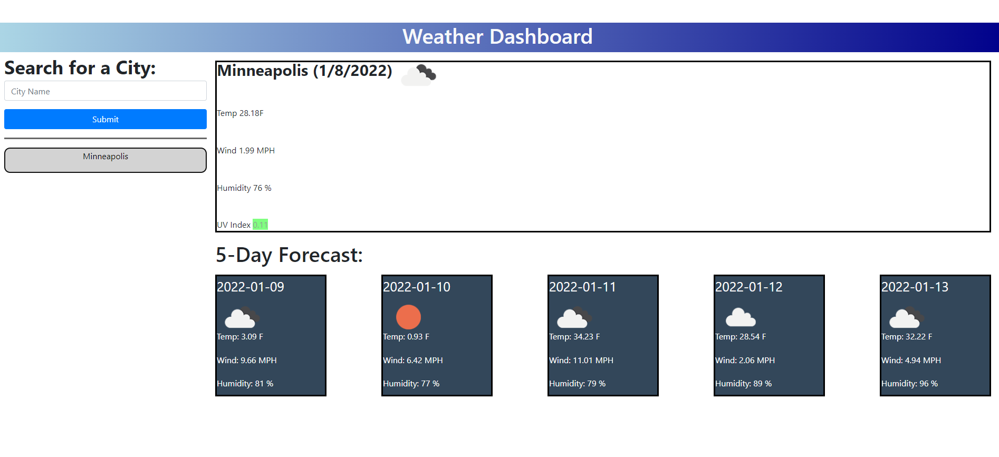

# Description

This project is a website that plugs into the openweathermAP. Users can enter a city in the search box and see what the city's current weather is like as well as a five day forecast. The data is stored in local storage for the users convenience.

# Deploying

If you wish to view the project simply click on the link below the image. Feel free to pull the repository (also linked below) if you wish to view the codebase. Thanks and please reach out to the email listed at the end of the document with any questions!

# Image of website

# Link to website

https://kyler-mclachlan.github.io/Server-Side-API/

# Link to Repository 

https://github.com/Kyler-Mclachlan/Server-Side-API

# Contributors 
Kyler Mclachlan 

# Questions 

Any questions about the project may be sent to Kyler.mclachlan@gmail.com